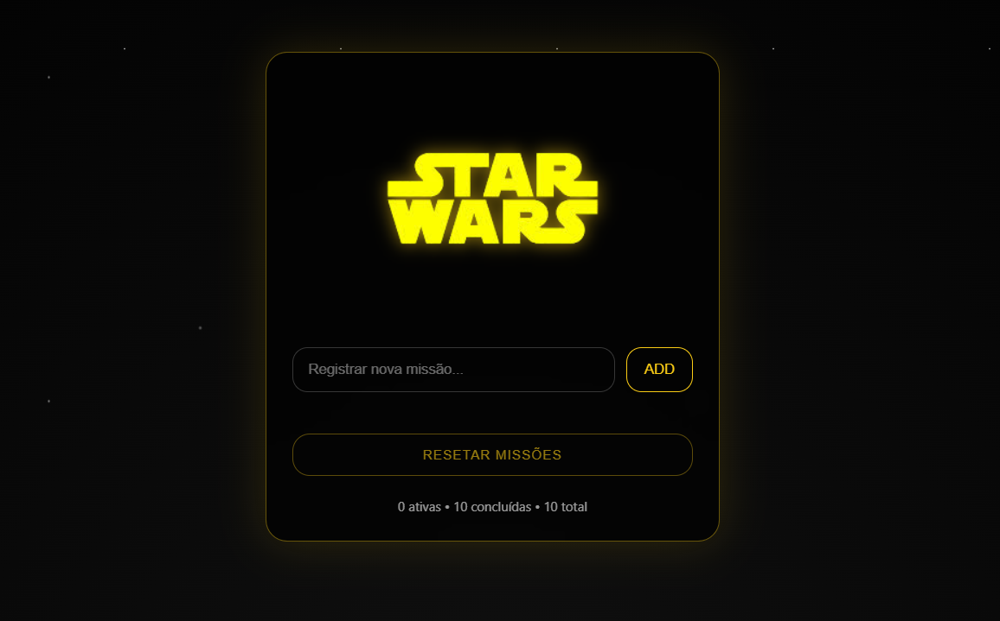

# ⭐ Star Wars Tasks

Uma **To-Do List futurista inspirada no universo Star Wars**, criada para portfolio.
O projeto foca em **UX moderna**, visual cinematográfico e código organizado, simulando um sistema de missões galácticas.

---

##  Como rodar o projeto

Siga os passos abaixo para rodar o **ToDoSW** localmente:

## 1. Clone o repositório:
No terminal, digite:
git clone https://github.com/brennoteixeira/ToDoSW.git
cd ToDoSW

## 2. Crie e ative um ambiente virtual (eu não utilizei para rodar o projeto daqui, é opcional, mas recomendado):

python -m venv venv      # cria o ambiente

No Windows
venv\Scripts\activate

No macOS/Linux
source venv/bin/activate

## 3. Instale as dependências:

pip install -r requirements.txt

## 4. Execute o projeto: 

python main.py

## 5. Clique no link para acessar o site

aparecera no terminal algo como:

 **Running on http://127.0.0.1:5000**

 ao aparecer, clique no link pressionando Crtl

 

## 🚀 Funcionalidades

-  Adicionar missões
-  Fixar e desafixar missões
-  Concluir missões 
-  Excluir missões individualmente
-  Reset em todas as missões (precisa de atualização)
-  Persistência com LocalStorage
-  Interface centralizada, moderna e minimalista

---

## 🛠 Tecnologias Utilizadas

- **HTML5** — estrutura semântica
- **CSS3** — UI moderna, bordas arredondadas, animações e glow
- **JavaScript (Vanilla)** — lógica, estado e interações
- **Python (Flask)** — backend e rotas
- **LocalStorage** — persistência de dados no navegador

---

## 📂 Estrutura do Projeto

star-wars-tasks/

│
├── app.py

├── templates/

│ └── index.html

│
├── static/

│ ├── css/

│ │ └── style.css

│ ├── js/

│ │ └── app.js

│ └── img/

│ └── SW.png

│
└── README.md

---

🎨 Design & UX

- Inspirado em interfaces futuristas e no clima cinematográfico de Star Wars

- Elementos centralizados para foco total

- Feedback visual claro para ações do usuário

- Tipografia forte e contraste elevado

---

📌 Próximos Upgrades (ideias)

-  Efeitos sonoros ao adicionar/concluir missões

-  Modo Lado Sombrio / Lado da Força

-  Modo de idioma em inglês

-  Autenticação temática (Jedi / Sith)

---

🧠 Autor

Desenvolvido por Brenno Teixeira
Projeto criado para estudo, prática de front-end, UX e integração com backend.

“Faça ou não faça. Tentativa não há.” — Mestre Yoda
